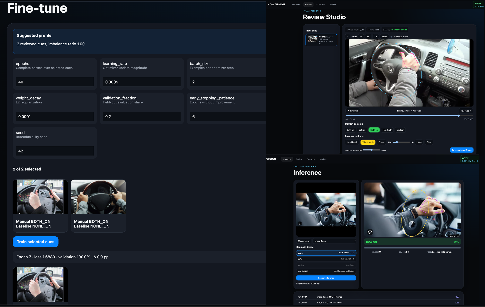

# Hands-On-Wheel-Project

**A local-first RGB image and video workbench for experimental Hands-On-Wheel detection pipeline**

[](#version)
[](#project-status)
[](#important-safety-notice)
[](#contributing)

> [!WARNING]
> **HOW Vision v1.0.0 is an unstable nightly release.**

 

> This version is intended for experimentation, research prototyping, interface evaluation, and community development. It is not production-ready, safety-certified, or validated for use in a vehicle, driver-monitoring system, or any other safety-critical environment.
>
> Expect incomplete behavior, changing interfaces, model limitations, and possible regressions between nightly versions.

---

## Overview

HOW Vision is a local-first workbench for exploring Hands-On-Wheel detection from RGB images and videos.

The project is intended to support an experimental end-to-end workflow:

1. Import an RGB image or video.
2. Run baseline Hands-On-Wheel inference.
3. Inspect frame-level predictions and visual evidence.
4. Review and correct model decisions.
5. Paint optional hand and wheel mask corrections.
6. Select reviewed frames for fine-tuning.
7. Fine-tune a compact decision-policy classifier.
8. Compare checkpoints and training sessions.
9. Preserve run metadata and outputs for reproducibility.

Version `1.0.0` consolidates the inference, review, fine-tuning, checkpoint management, hardware selection, runtime telemetry, and model-lineage concepts explored during earlier development.

The implementation remains a research prototype. Model output should be treated as inspectable evidence, not as a reliable statement about driver behavior.

---

## Project Status

| Area | Status |
|---|---|
| Image upload | Experimental |
| Video upload | Experimental |
| Input preview | Experimental |
| Frame-level inference | Experimental |
| Hand landmark perception | Experimental |
| Wheel geometry detection | Baseline |
| Hands-On-Wheel classification | Baseline |
| Temporal smoothing | Experimental |
| Review Studio | Unstable |
| Manual label correction | Experimental |
| Painted mask correction | Experimental |
| Fine-tuning | Experimental |
| CUDA support | Best effort |
| Apple MPS support | Best effort |
| CPU fallback | Implemented |
| Model checkpointing | Experimental |
| Model lineage | Experimental |
| Production readiness | Not ready |
| Safety certification | Not available |

The project is under active exploration. Interfaces, output schemas, configuration values, and stored artifacts can change between nightly releases.

---

## Version

```text
Project: HOW Vision
Version: 1.0.0
Archive: how-vision-final-v1.0.0.tar.gz
Release type: Unstable nightly
Development stage: Experimental prototype
Production status: Not production-ready
```

---

## Features

### Inference

The Inference workspace is designed to support:

- RGB image inputs
- RGB video inputs
- controlled local uploads
- image preview
- video preview
- ordered frame-by-frame processing
- raw Hands-On-Wheel prediction
- temporally smoothed prediction
- final HOW status
- prediction confidence
- hand evidence overlays
- wheel evidence overlays
- frame progress
- checkpoint selection
- hardware selection
- runtime device reporting
- run manifests
- JSONL prediction records
- CSV exports
- non-overwriting run directories

Internal classifier states include:

```text
LEFT_ON
RIGHT_ON
BOTH_ON
NONE_ON
UNKNOWN
```

Final status mapping:

```text
LEFT_ON  -> HOW_ON
RIGHT_ON -> HOW_ON
BOTH_ON  -> HOW_ON
NONE_ON  -> HOW_OFF
UNKNOWN  -> UNKNOWN
```

### Frame Navigation

Multi-frame runs can expose frame navigation controls for examining individual predictions.

The intended navigation workflow includes:

- frame slider
- frame ID
- timestamp
- HOW status
- confidence
- overlay preview
- selected checkpoint
- actual compute device

Standalone images contain one deterministic frame with:

```text
frame_id = 0
sequence_index = 0
timestamp_ms = 0
```

Video frames should preserve decode order and retain native timestamps when available.

### Hardware Selection

The application can inspect the local environment for:

```text
Auto
CPU
CUDA
MPS
```

Automatic selection follows this preference order:

```text
CUDA -> MPS -> CPU
```

Before using CUDA or MPS, the application attempts a small device operation. If initialization fails, the application falls back to CPU and records the fallback reason.

> [!NOTE]
> Accelerator selection does not mean that every pipeline operation runs on the selected accelerator.
>
> OpenCV-based media decoding, geometric wheel detection, and some perception operations can remain CPU-based. The selected accelerator is primarily relevant to compatible PyTorch operations and fine-tuning.

### Runtime Telemetry

The application includes an experimental runtime status area containing:

- application status
- CPU utilization
- RAM utilization
- process memory
- detected accelerator
- selected compute device
- actual compute device
- local date and time

Telemetry is intended for visibility and troubleshooting. It is not a standardized benchmark.

---

## System Architecture

The intended processing architecture is:

```text
Controlled input
    |
    v
Frame decoding
    |
    v
Frame identity and timestamps
    |
    v
Hand perception
    |
    v
Wheel perception
    |
    v
Contact feature extraction
    |
    v
HOW classifier
    |
    v
Temporal decision layer
    |
    v
Overlay renderer
    |
    v
Run artifacts and manifest
```

Review and fine-tuning should consume completed run artifacts without mutating the original inference output.

The project aims to keep the following components logically independent:

```text
HandDetector
WheelDetector
HOWClassifier
TemporalDecisionProcessor
OverlayRenderer
OutputLogger
TrainingService
ModelRegistry
```

Framework-specific objects should remain inside adapters. Application modules should exchange project-owned result structures.

---

## Installation

### Requirements

Recommended environment:

- Python 3.11 or newer
- Linux, macOS, or Windows with a compatible Python environment
- a modern browser
- local filesystem access
- sufficient disk space for videos, frames, overlays, and checkpoints

Optional acceleration:

- NVIDIA GPU with a compatible CUDA-enabled PyTorch installation
- Apple silicon or compatible macOS hardware with MPS-enabled PyTorch

### Extract the Archive

```bash
git clone https://github.com/pradeep-vishnu/hands-on-wheel-project.git
cd hands-on-wheel-project
```

### Run Setup

```bash
./scripts/setup.sh
```

The setup process can:

- create a local virtual environment
- install Python dependencies
- install testing dependencies
- prepare project directories
- download the MediaPipe Hand Landmarker model when supported

### Manual Environment Setup

If the setup script cannot be used:

```bash
python3 -m venv .how_venv
source .how_venv/bin/activate
python -m pip install --upgrade pip
python -m pip install -e ".[test]"
```

On Windows PowerShell:

```powershell
python -m venv .how_venv
.how_venv\Scripts\Activate.ps1
python -m pip install --upgrade pip
python -m pip install -e ".[test]"
```

---

## Running the Application

Start HOW Vision with:

```bash
./scripts/run.sh
```

Each launch is intended to use:

- a newly allocated localhost port
- a random session query value

This design reduces the risk of the browser reopening an older localhost origin with stale assets.

Keep the terminal open while using HOW Vision.

The terminal should print the active address. Copy the address into a browser if the browser does not open automatically.

---

## Typical Workflow

### 1. Start HOW Vision

```bash
./scripts/run.sh
```

### 2. Select a Compute Device

Choose one of:

```text
Auto
CPU
CUDA
MPS
```

Use CPU when troubleshooting accelerator-specific behavior.

### 3. Upload Input Data

Upload a supported RGB image or video formats:

```text
.jpg
.jpeg
.png
.bmp
.webp
.mp4
.avi
.mov
.mkv
```

Actual codec availability depends on the installed OpenCV build and operating system.

### 4. Select a Checkpoint

Choose:

```text
Baseline
```

or a previously generated fine-tuned checkpoint. Checkpoint compatibility is not guaranteed between nightly releases.

### 5. Run Inference

Launch inference and inspect:

- active frame
- overlay preview
- raw prediction
- temporal prediction
- final HOW status
- confidence
- selected checkpoint
- selected device
- actual device
- progress
- output run ID

### 6. Inspect Frames

For videos, use the frame slider to inspect individual predictions.

Review:

- frame ID
- timestamp
- HOW state
- confidence
- hand evidence
- wheel evidence

### 7. Open Review Studio

Select a completed run.

Use the frame scrubber for multi-frame inputs and correct labels or masks where necessary.

### 8. Save Reviewed Frames

Save frames that should become fine-tuning cues.

Original model predictions should remain separately available.

### 9. Select Fine-Tuning Cues

Open Fine-tune and select reviewed frames for training.

Inactive cues should be excluded from training.

### 10. Configure Training

Use suggested hyperparameters as a starting point or edit the values manually.

### 11. Train

Inspect:

- epoch number
- training loss
- validation accuracy
- accuracy delta
- prediction changes
- checkpoint metadata

### 12. Compare Models

Open Models and compare:

- baseline
- previous fine-tuning sessions
- latest fine-tuning session

---

## Review Studio

Review Studio is intended to provide a frame-level correction workflow.

### Run Selection

Available run information can include:

- input filename
- run ID
- frame count
- execution date
- execution time
- selected checkpoint

### Frame Navigation

Review Studio can include:

- frame slider
- current frame ID
- current timestamp
- ending timestamp
- previous reviewed-frame control
- next reviewed-frame control
- reviewed-frame position

### Decision Correction

Available labels:

```text
BOTH_ON
LEFT_ON
RIGHT_ON
NONE_ON
UNKNOWN
```

The manually selected label should be stored separately from the original model prediction.

### Mask Correction

Experimental mask correction can include:

- hand brush
- wheel brush
- eraser
- adjustable brush size
- undo
- clear
- predicted evidence toggle

### Zoom and Navigation

The review viewport can include:

- zoom in
- zoom out
- fit
- 1:1
- move mode
- right-click drag to pan
- reset view

Viewport operations should not modify stored image or annotation coordinates.

### Unsaved Changes

When leaving a frame with unsaved edits, the interface can offer:

```text
Undo last
Discard
Save & continue
```

### Annotation Structure

Example:

```json
{
  "run_id": "run_0001",
  "frame_id": 42,
  "label": "BOTH_ON",
  "original_label": "RIGHT_ON",
  "reward": 1.0,
  "hand_strokes": [
    {
      "tool": "hand",
      "points": [
        [0.20, 0.35],
        [0.22, 0.37]
      ]
    }
  ],
  "wheel_strokes": [],
  "include_training": true
}
```

Stroke coordinates can be normalized to the displayed image or stored in source-image coordinates. The frontend and backend must use the same convention.

---

## Fine-Tuning

The Fine-tune workspace is intended to support:

- reviewed cue previews
- manual annotation display
- baseline prediction display
- selected and deselected training cues
- suggested hyperparameters
- editable hyperparameters
- epoch progress
- training loss
- validation accuracy
- validation-accuracy change
- before-and-after prediction comparison
- checkpoint creation
- checkpoint metadata
- parameter count
- checkpoint-size reporting

### Training Cue Preview

Each cue can show:

```text
Manual label
Baseline prediction
Current checkpoint prediction
Confidence
Run ID
Frame ID
Painted masks
Active or inactive state
```

Inactive cues should be dimmed and excluded from training.

### Performance Dashboard

The training dashboard can display:

- training loss by epoch
- validation accuracy by epoch
- accuracy delta from the previous epoch
- manual label
- baseline prediction
- fine-tuned prediction
- fine-tuned confidence
- selected cue count
- validation cue count
- training device

Example:

```text
Manual label: BOTH_ON
Baseline prediction: RIGHT_ON
Fine-tuned prediction: BOTH_ON
Fine-tuned confidence: 78.4%
```

> [!IMPORTANT]
> Performance changes on selected or validation cues do not prove general improvement.
>
> Reliable improvement requires evaluation on an independent, fixed, representative test set.

---

## Hyperparameters

### Epochs

The number of complete passes over the selected reviewed cues.

Higher values provide more optimization steps but can increase overfitting.

### Learning Rate

The optimizer update magnitude.

A value that is too high can cause unstable updates. A value that is too low can result in limited improvement.

### Batch Size

The number of selected examples processed before an optimizer update.

Small reviewed datasets generally require small batch sizes.

### Hidden Width

The number of neurons in the compact classifier's hidden layer.

Increasing hidden width increases model capacity and parameter count.

### Weight Decay

L2-style regularization applied during optimization.

Weight decay can reduce overfitting but may reduce learning when the dataset is very small.

### Validation Fraction

The proportion of selected cues reserved for held-out evaluation.

A very small dataset can produce noisy and misleading validation results.

### Early-Stopping Patience

The number of epochs allowed without improved validation performance.

Training stops when no improvement is observed for the configured number of epochs.

### Gradient Clipping

The maximum gradient norm allowed during optimization.

Gradient clipping can reduce unstable updates.

### Random Seed

The value used for data splitting, initialization, and deterministic training operations.

Using the same seed improves reproducibility, but exact results can still vary across devices, operating systems, and dependency versions.

---

## Suggested Hyperparameters

The application can generate basic suggestions using signals such as:

- reviewed-cue count
- selected-cue count
- represented classes
- class distribution
- class imbalance
- validation-set size

Suggested values are heuristics. They do not guarantee maximum accuracy.

---

## Models and Checkpoints

The Models workspace is intended to show model evolution across training sessions.

Model metadata can include:

- checkpoint ID
- creation date
- parent checkpoint
- validation accuracy
- selected training-cue count
- hyperparameters
- actual compute device
- parameter count
- checkpoint size
- epoch history

Example lineage:

```text
baseline
  └── how_20260928_120000_utc
       └── how_20260928_123000_utc
```

### Model Size

The interface should distinguish:

```text
Perception model
Decision-policy model
Complete active pipeline
```

Fine-tuning the compact decision policy can change checkpoint bytes without changing the number of model parameters.

Example:

```text
Before:
269 parameters
4.8 KB checkpoint

After:
269 parameters
5.1 KB checkpoint

Delta:
0 parameters
+0.3 KB
```

---

## Outputs and Reproducibility

Every inference run should use a unique directory:

```text
out_dir/
├── run_0001/
├── run_0002/
├── run_0003/
└── ...
```

Existing run numbers should never be reused.

A run can contain:

```text
run_0001/
├── manifest.json
├── config.yaml
├── metrics.json
├── predictions.csv
├── predictions.jsonl
├── output.mp4
├── frames/
│   ├── frame_000000.jpg
│   ├── frame_000001.jpg
│   └── ...
├── overlays/
│   ├── frame_000000.jpg
│   ├── frame_000001.jpg
│   └── ...
└── logs/
    └── run.log
```

### Manifest

The manifest can include:

```json
{
  "run_id": "run_0001",
  "status": "COMPLETED",
  "created_at": "2026-09-28T10:00:00Z",
  "completed_at": "2026-09-28T10:02:10Z",
  "input": "sample_video.mp4",
  "input_hash": "sha256-value",
  "frames": 1135,
  "requested_device": "auto",
  "actual_device": "cpu",
  "device_name": "CPU",
  "fallback_reason": null,
  "checkpoint": "baseline"
}
```

A failed run should never be marked as completed.

### Prediction Record

Example:

```json
{
  "run_id": "run_0001",
  "source_file": "sample_video.mp4",
  "frame_id": 17,
  "timestamp_ms": 680.0,
  "raw_prediction": "RIGHT_ON",
  "how_state": "RIGHT_ON",
  "how_status": "HOW_ON",
  "confidence": 0.71,
  "checkpoint": "baseline"
}
```

Rich nested evidence belongs in JSONL.

Stable tabular columns belong in CSV.

---

## Configuration

Central configuration can be stored in:

```text
configs/default.yaml
```

Configuration areas can include:

```yaml
app:
  version: 1.0.0

paths:
  data: data
  output: out_dir
  database: howvision.db
  hand_model: models/hand_landmarker.task
  registry: models/registry.json

input:
  images:
    - .jpg
    - .jpeg
    - .png
    - .bmp
    - .webp
  videos:
    - .mp4
    - .avi
    - .mov
    - .mkv

perception:
  hand_confidence: 0.5
  wheel_confidence: 0.25

classifier:
  contact_distance: 0.18
  no_contact_distance: 0.30

temporal:
  confidence_threshold: 0.42
  smoothing_window: 5
  on_confirmation_frames: 2
  off_confirmation_frames: 3
  unknown_timeout: 4

training:
  epochs: 30
  learning_rate: 0.001
  batch_size: 8
  hidden_width: 24
  weight_decay: 0.0001
  validation_fraction: 0.2
  early_stopping_patience: 6
  gradient_clip: 1.0
  seed: 42

review:
  brush_size: 18
  min_brush: 6
  max_brush: 64
```

Paths, thresholds, codecs, and temporal parameters should remain centralized rather than being spread across modules.

---

## Testing

Run the included Python test suite:

```bash
pytest
```

Run frontend JavaScript syntax validation:

```bash
node --check frontend/app.js
```

Run Python compilation checks:

```bash
python -m compileall -q howvision scripts
```

The v1.0.0 nightly package was reported as passing:

```text
6 passed
final smoke PASS
```

This result only confirms the included automated checks. It does not prove production reliability or model accuracy.

### Recommended Test Coverage

The project should eventually include tests for:

```text
image input decoding
video input decoding
frame order
sequential frame IDs
native timestamps
image output dimensions
video output dimensions
stable CSV schema
valid JSONL records
manifest completeness
atomic run allocation
recoverable frame errors
UNKNOWN reachability
temporal confirmation
temporal reset
device discovery
CPU fallback
review label save
review brush save
annotation reload
unsaved slider navigation
save-and-continue navigation
discard-and-continue navigation
Ctrl+Z
Cmd+Z
reviewed-frame navigation
selected-cue filtering
hyperparameter validation
epoch-history persistence
checkpoint creation
checkpoint loading
checkpoint inference
model lineage
random-port launch
frontend and backend version matching
```

---

## Known Limitations

Version `1.0.0` is an unstable nightly build.

Known or expected limitations include:

- UI state can become inconsistent after rapid navigation.
- Browser caching can expose stale frontend assets.
- Review Studio transitions can fail if frontend and backend schemas differ.
- Mask painting is experimental.
- Brush coordinate mapping can be inaccurate after resizing.
- Zoom and pan behavior can vary by browser.
- Video codecs can behave differently across operating systems.
- GPU availability depends on the installed PyTorch build and drivers.
- CUDA or MPS selection does not accelerate all operations.
- OpenCV processing remains CPU-oriented.
- Fine-tuning can overfit small reviewed datasets.
- Validation accuracy can be misleading for small validation sets.
- Model comparison can be invalid when sessions use different splits.
- Wheel geometry detection can fail at unusual camera angles.
- Hand polygons are approximate landmark hulls.
- Painted masks are not guaranteed to train a segmentation model.
- Confidence values are not calibrated safety probabilities.
- A generated checkpoint can perform worse than the baseline.
- Backward compatibility between nightly releases is not guaranteed.
- Automatic database migrations are incomplete.
- Interrupted jobs can leave partial output.
- Multi-user behavior is not supported.
- Concurrent job handling is experimental.
- The application has not been security-audited.
- The application has not been performance-certified.
- The application has not been safety-certified.

---

## Troubleshooting

### Browser Opens an Older Version

Stop all running HOW Vision processes and launch again:

```bash
./scripts/run.sh
```

The launcher should create a new localhost port.

Inspect active processes:

```bash
ps aux | grep -E "uvicorn|howvision"
```

On Windows PowerShell:

```powershell
Get-Process python
```

### The Application Does Not Open Automatically

Run:

```bash
./scripts/run.sh
```

Copy the printed URL into a browser.

### CUDA Is Not Available

Check PyTorch CUDA support:

```bash
python -c "import torch; print(torch.cuda.is_available()); print(torch.version.cuda)"
```

If CUDA is unavailable, select CPU.

### MPS Is Not Available

On compatible macOS systems:

```bash
python -c "import torch; print(torch.backends.mps.is_built()); print(torch.backends.mps.is_available())"
```

If MPS is unavailable, select CPU.

### MediaPipe Model Is Missing

Run setup again:

```bash
./scripts/setup.sh
```

Check the model:

```bash
ls -lh models/hand_landmarker.task
```

### Review Save Returns 422

A `422 Unprocessable Content` response usually means that the annotation JSON does not match the backend schema.

Verify:

- `run_id`
- `frame_id`
- `label`
- `original_label`
- `reward`
- `hand_strokes`
- `wheel_strokes`
- `include_training`

Each stroke should contain:

```json
{
  "tool": "hand",
  "points": [
    [0.1, 0.2],
    [0.2, 0.3]
  ]
}
```

### Fine-Tuning Does Not Start

At least two selected reviewed cues are typically required.

Check that:

- reviewed frames were saved
- reviewed cues appear in Fine-tune
- at least two cues are active
- labels are valid
- PyTorch is installed
- hyperparameter values are valid

### Checkpoint Does Not Appear

Refresh the Models or Inference page.

Check:

```text
models/registry.json
models/versions/
```

Verify that the training job completed successfully.

### Video Output Is Missing

Check:

- source video format
- OpenCV codec availability
- output directory permissions
- terminal errors
- run manifest status
- run log

---

## Development Philosophy

HOW Vision is intended to evolve slowly.

The project prioritizes:

- correctness over feature count
- observable behavior over hidden automation
- modular components over monolithic scripts
- stable interfaces over rapid redesign
- explicit uncertainty over forced classification
- reproducibility over presentation
- human review over autonomous action
- community review over unverified claims

Development pace will remain conservative unless community contributions increase the available implementation, testing, documentation, and maintenance capacity.

---

## Roadmap

The roadmap is intentionally conservative and contribution-driven.

### Short Term

- stabilize controlled image and video input
- improve test coverage
- verify frame ordering
- verify timestamps
- improve manifest completeness
- harden filesystem behavior
- validate CPU fallback
- stabilize Review Studio saves
- stabilize annotation reload
- improve UI state transitions

### Medium Term

- reliable mask coordinate mapping
- versioned reviewed datasets
- fixed model evaluation sets
- robust checkpoint loading
- meaningful parent-child checkpoint comparison
- better wheel perception
- calibrated confidence
- improved keyboard accessibility
- improved touch support

### Long Term

- replaceable learned classifiers
- segmentation training
- richer temporal models
- reproducible dataset releases
- benchmark tooling
- plugin interfaces
- documented extension APIs
- stronger performance profiling
- broader hardware compatibility

No roadmap item should be interpreted as a delivery commitment.

Project evolution will remain slow unless community involvement provides additional development capacity.

---

## Contributing

Contributors, testers, researchers, designers, and maintainers are welcome.

The project is particularly interested in contributions related to:

- modular hand-perception adapters
- robust steering-wheel detection
- temporal decision logic
- annotation coordinate mapping
- browser interaction tests
- video codec compatibility
- CUDA behavior
- MPS behavior
- synthetic test fixtures
- dataset versioning
- checkpoint evaluation
- confidence calibration
- class-imbalance handling
- accessible interface design
- performance profiling
- database migrations
- reproducibility metadata
- technical writing
- installation documentation

Pull requests are welcome.

Before opening a pull request:

1. Keep the change focused.
2. Explain the problem being addressed.
3. Include tests where practical.
4. Preserve existing run, dataset, and checkpoint files.
5. Do not silently change schemas.
6. Document configuration changes.
7. Report the exact tests executed.
8. Avoid claiming performance improvements without reproducible evaluation.
9. Preserve `UNKNOWN` as a valid result.
10. Avoid hidden network dependencies.
11. Avoid overwriting existing project artifacts.
12. Keep framework-specific objects inside adapters.
13. Prefer small modules over monolithic scripts.
14. Include migration notes when storage formats change.

---

## Issue Reports

When reporting an issue, include:

- operating system
- Python version
- HOW Vision version
- browser
- input format
- selected device
- selected checkpoint
- terminal error
- run manifest
- reproduction steps
- expected behavior
- actual behavior

Do not upload confidential or personally identifiable driving footage.

---

## Support the Project

If HOW Vision is useful, please consider contributing. The project is looking forward to contributors who can help transform unstable nightly experiments into a modular, testable, and trustworthy open-source workbench.

---

## Nightly Release Disclaimer

> HOW Vision v1.0.0 is an unstable nightly research prototype.
>
> Interfaces, schemas, model behavior, configuration, and stored artifacts can change without backward compatibility.
>
> Do not use this build for any decision making.
>
> Validate every workflow locally, preserve original data, retain run metadata, and independently review model output.
